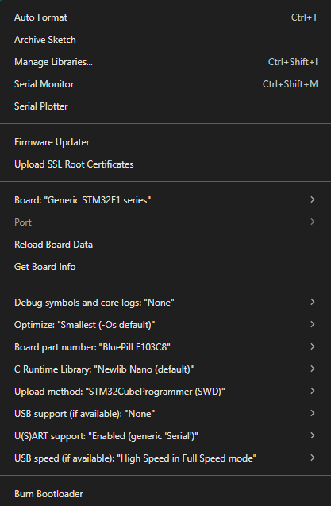
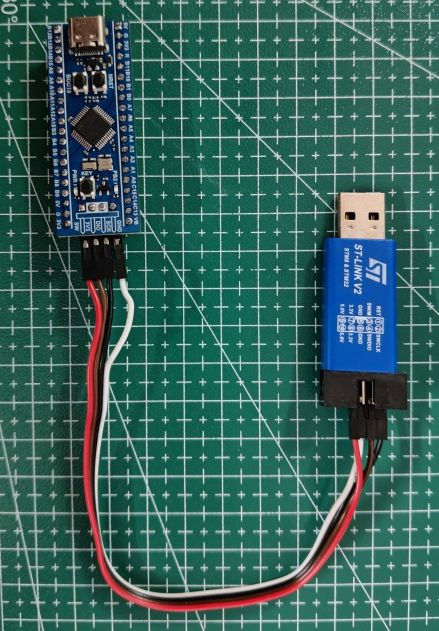
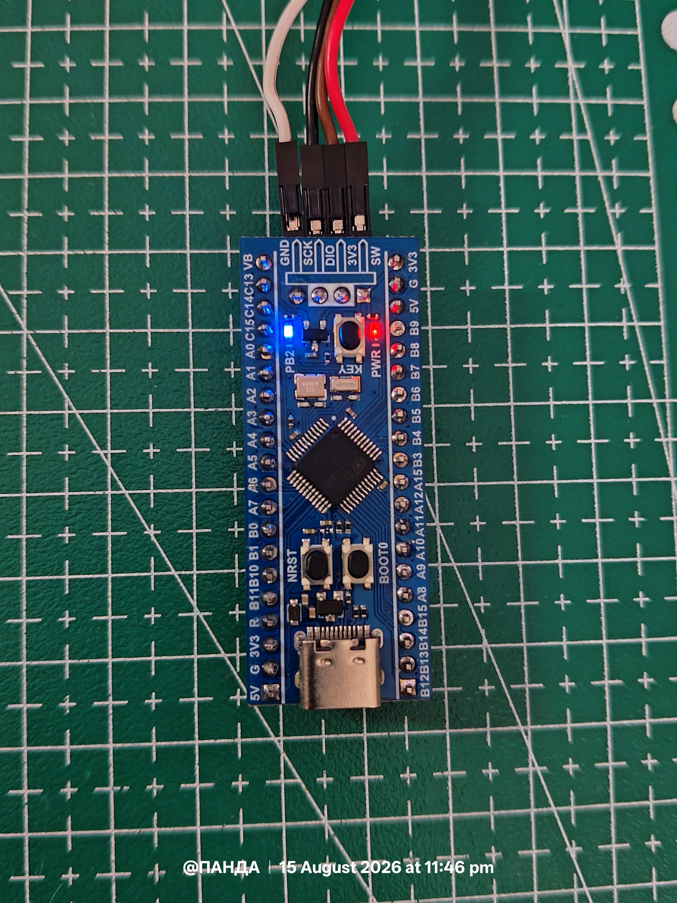
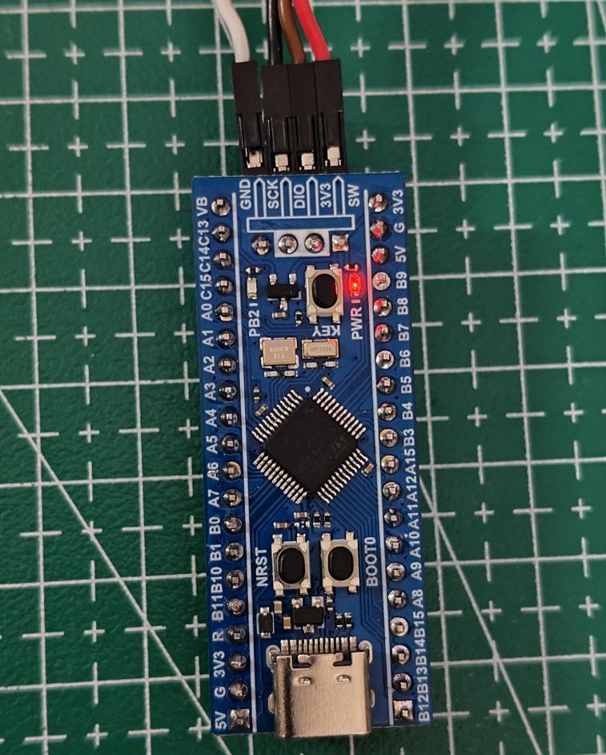

# Arduino-Style GPIO Blink Using STM32duino

This is the **beginner entry point** of this repository. Before touching bare-metal registers (see `00_Basics`), this section shows how to program the same STM32F103C8T6 "Bluepill" board using the **Arduino IDE**, via the **STM32duino** core — the same way you'd program any Arduino board, just targeting an STM32 instead of an AVR.

No register addresses, no RCC clock-enable bits, no SysTick math. Just `pinMode()`, `digitalWrite()`, and `delay()`. The goal of this folder is to get a beginner from "blank board" to "blinking LED" as fast as possible, and to give a mental anchor point that `blink.ino` onward, and eventually `01_Onboard_LED`, will build on and eventually strip away.

> **New to embedded programming?** Start here. Once this works and makes sense, `00_Absolute_beginner_Basics` shows you exactly what `pinMode()` and `digitalWrite()` are doing underneath, register by register.

---

## Table of Contents

- [Arduino-Style GPIO Blink Using STM32duino](#arduino-style-gpio-blink-using-stm32duino)
  - [Table of Contents](#table-of-contents)
  - [What This Folder Covers](#what-this-folder-covers)
  - [Hardware Requirements](#hardware-requirements)
  - [Installing the Arduino IDE](#installing-the-arduino-ide)
  - [Installing the STM32duino Core](#installing-the-stm32duino-core)
  - [Board Configuration](#board-configuration)
  - [Wiring / SWD Connection](#wiring--swd-connection)
  - [The First Sketch — Blink](#the-first-sketch--blink)
  - [Line-by-Line Walkthrough](#line-by-line-walkthrough)
    - [1. Naming the pin](#1-naming-the-pin)
    - [2. `setup()`](#2-setup)
    - [3. `loop()`](#3-loop)
    - [4. `delay(500)`](#4-delay500)
    - [Result](#result)
  - [Uploading the Sketch](#uploading-the-sketch)
  - [Reading the Upload Output](#reading-the-upload-output)
  - [Project Gallery](#project-gallery)
  - [Terminal Output](#terminal-output)
  - [Gotchas \& Lessons Learned](#gotchas--lessons-learned)
  - [Arduino vs. Bare-Metal — What's Actually Happening](#arduino-vs-bare-metal--whats-actually-happening)
  - [What This Example Demonstrates](#what-this-example-demonstrates)

---

## What This Folder Covers

This example toggles a GPIO pin on the Bluepill on and off every 500 ms — a classic "Blink" — written entirely using the standard Arduino API (`pinMode`, `digitalWrite`, `delay`), compiled and flashed through the Arduino IDE using an **ST-Link V2** debug probe.

Unlike a stock Arduino Uno/Nano, the Bluepill is not natively supported by the Arduino IDE. It needs an additional **board package (core)** installed — STM32duino — which teaches the IDE how to compile for the STM32F103 and how to talk to it during upload.

---

## Hardware Requirements

| Item | Notes |
|---|---|
| STM32F103C8T6 Bluepill (or Bluepill Plus) | Target board |
| ST-Link V2 | SWD programmer, same unit used in `01_Onboard_LED` |
| Micro-USB / USB-C cable | Only needed if you want to power the board independently of the ST-Link |
| Jumper wires (4×) | For SWD connection |
| LED + resistor (optional) | Only needed if your board's onboard LED isn't wired the way you expect — see [Gotchas](#gotchas--lessons-learned) |

---

## Installing the Arduino IDE

1. Download and install the **Arduino IDE** (2.x recommended) from [arduino.cc](https://www.arduino.cc/en/software).
2. Open the IDE once after installing to let it finish its first-time setup.

---

## Installing the STM32duino Core

The Bluepill isn't in the Arduino IDE's board list by default. STM32duino adds STM32 support the same way any third-party board package does:

1. Open **File → Preferences**.
2. In **Additional Boards Manager URLs**, paste:
   ```
   https://github.com/stm32duino/BoardManagerFiles/raw/main/package_stmicroelectronics_index.json
   ```
3. Open **Tools → Board → Boards Manager…**
4. Search for **STM32** and install **"STM32 MCU based boards"** (by STMicroelectronics).
5. Once installed, restart the IDE.

You should now see **STM32 boards** as a category under **Tools → Board**.

---

## Board Configuration

Under **Tools**, set the following (this is exactly what this example was built and tested with):

| Setting | Value |
|---|---|
| Board | Generic STM32F1 series |
| Board part number | BluePill F103C8 |
| Upload method | STM32CubeProgrammer (SWD) |
| U(S)ART support | Enabled (generic 'Serial') |
| USB support | None |
| C Runtime Library | Newlib Nano (default) |
| Optimize | Smallest (-Os default) |
| Debug symbols and core logs | None |

**Port** stays blank/greyed out — expected, since SWD upload via ST-Link doesn't go over a COM port the way a USB-serial Arduino upload does.




---

## Wiring / SWD Connection

Identical physical connection to `01_Onboard_LED` — the STM32duino upload method used here (`STM32CubeProgrammer (SWD)`) drives the ST-Link exactly the same way STM32CubeProgrammer does on its own.

```
ST-LINK          STM32F103C8T6
───────────────────────────────
3.3V      ──────  3.3V
GND       ──────  GND
SWDIO     ──────  PA13
SWCLK     ──────  PA14
NRST      ──────  NRST
```

> **Important:** Do not connect the ST-Link's 5V output to the Bluepill's 3.3V pin. Also avoid powering the board from both the ST-Link's 3.3V pin **and** an independent USB cable at the same time.

---

## The First Sketch — Blink


```cpp
#define LED_PIN PB2   // onboard user LED on this board — check yours, see Gotchas below

void setup() {
  pinMode(LED_PIN, OUTPUT);
}

void loop() {
  digitalWrite(LED_PIN, !digitalRead(LED_PIN));  // toggle
  delay(500);
}
```

That's the entire program. Three Arduino API calls (`pinMode`, `digitalWrite`, `digitalRead`) and one timing call (`delay`) replace everything the bare-metal version in `01_Onboard_LED` does by hand.

---

## Line-by-Line Walkthrough

### 1. Naming the pin

```cpp
#define LED_PIN PB2
```

STM32duino defines symbolic pin names (`PB2`, `PA0`, `PC13`, etc.) that map directly to the STM32's own port/pin naming — unlike classic Arduino boards, which use numeric pin labels (`D13`) that hide which physical MCU pin is used. This is one of the few places STM32duino's Arduino layer stays close to the underlying hardware naming, which is convenient for anyone who'll eventually read a datasheet.

### 2. `setup()`

```cpp
void setup() {
  pinMode(LED_PIN, OUTPUT);
}
```

`setup()` runs once at boot. `pinMode(LED_PIN, OUTPUT)` configures PB2 as a digital output. Underneath, this single call does everything `GPIO_Init()` does manually in `01_Onboard_LED`:

- Enables the clock for GPIOB in `RCC_APB2ENR`
- Writes the correct `MODE`/`CNF` bits into `GPIOB_CRL` for output push-pull mode

### 3. `loop()`

```cpp
void loop() {
  digitalWrite(LED_PIN, !digitalRead(LED_PIN));
  delay(500);
}
```

`loop()` runs repeatedly forever after `setup()` completes — this is the Arduino runtime's built-in `while(1)`, so you never write the infinite loop yourself.

- `digitalRead(LED_PIN)` reads the pin's current output state.
- `!digitalRead(LED_PIN)` inverts it (`HIGH` becomes `LOW` and vice versa).
- `digitalWrite(LED_PIN, ...)` writes that inverted value back out.

Together, this toggles the pin every call — the Arduino-level equivalent of:

```c
GPIOB_ODR ^= (1 << 2);
```

from the bare-metal example.

### 4. `delay(500)`

```cpp
delay(500);
```

Pauses execution for 500 milliseconds. Internally, STM32duino's `delay()` is driven by the same **SysTick timer** that `01_Onboard_LED` configures by hand in `SysTick_Init()` — the core sets it up automatically at boot, and `delay()` simply reads that running millisecond counter instead of you writing your own `msTicks` variable and `delay_ms()` function.

### Result

Same outcome as the bare-metal example: PB2 toggles every 500 ms, giving a ~1 Hz square wave with a 50% duty cycle.

---

## Uploading the Sketch

1. Connect the ST-Link to the Bluepill as shown in [Wiring](#wiring--swd-connection).
2. Open `Blink_Arduino.ino` in the Arduino IDE.
3. Confirm the board settings from [Board Configuration](#board-configuration) are all set.
4. Click **Upload** (→ icon), or **Sketch → Upload**.

The IDE compiles the sketch, then invokes STM32CubeProgrammer in the background to erase and flash the board over SWD, then resets it so it starts running immediately.

---

## Reading the Upload Output

A successful upload looks like this:

```
Sketch uses 9320 bytes (14%) of program storage space. Maximum is 65536 bytes.
Global variables use 856 bytes (4%) of dynamic memory, leaving 19624 bytes for local variables. Maximum is 20480 bytes.
Selected interface: swd
      -------------------------------------------------------------------
                       STM32CubeProgrammer v2.23.0
      -------------------------------------------------------------------
Board       : --
Device ID   : 0x410
Device name : STM32F101/F102/F103 Medium-density
...
Download in Progress:
File download complete
Application is running, Please Hold on...
Start operation achieved successfully
```

What to check here:

| Line | Meaning |
|---|---|
| `Sketch uses ... bytes ... Maximum is 65536` | Flash usage — confirms your binary fits comfortably in the F103C8's 64 KB flash |
| `Global variables use ...` | RAM usage — well under the 20 KB SRAM limit for a simple sketch |
| `Device ID: 0x410` | Confirms the connected chip is genuinely a medium-density STM32F103, matching the Bluepill part |
| `File download complete` | Flash write succeeded |
| `Application is running` | ST-Link released reset and the chip started executing your code |

---

## Project Gallery


<table>
  <tr>
    <td align="center">
      
      <br><b>ST-Link and Blue Pill</b>
    </td>
    <td align="center">
      
      <br><b>PB2 Blink</b>
    </td>
    <td align="center">
      
      <br><b>Power Led</b>
    </td>
  </tr>
</table>


---


## Terminal Output


```
Sketch uses 9452 bytes (14%) of program storage space. Maximum is 65536 bytes.
Global variables use 852 bytes (4%) of dynamic memory, leaving 19628 bytes for local variables. Maximum is 20480 bytes.
Selected interface: swd
      -------------------------------------------------------------------
                       STM32CubeProgrammer v2.23.0                  
      -------------------------------------------------------------------

ST-LINK SN  : 000000000001
ST-LINK FW  : V2J37S7
Board       : --
Voltage     : 3.29V
SWD freq    : 4000 KHz
Connect mode: Under Reset
Reset mode  : Hardware reset
Device ID   : 0x410
Revision ID : Rev X
Device name : STM32F101/F102/F103 Medium-density
NVM size    : 64 KBytes
Device type : MCU
Device CPU  : Cortex-M3
BL Version  : --


Opening and parsing file: sketch_aug18a.ino.bin


Memory Programming ...
  File          : sketch_aug18a.ino.bin
  Size          : 9.51 KB 
  Address       : 0x08000000


Erasing memory corresponding to segment 0:
Erasing internal memory sectors [0 9]
Download in Progress:


File download complete
Time elapsed during download operation: 00:00:00.671

RUNNING Program ... 
  Address:      : 0x8000000
Application is running, Please Hold on...
Start operation achieved successfully

```


## Gotchas & Lessons Learned

1. **Confirm your LED pin before assuming it's PC13.** Most generic Bluepill tutorials assume the onboard LED is on PC13 (active-low). Some board variants — including the WeAct Bluepill Plus documented in `01_Onboard_LED` — wire the user LED to **PB2** instead. Check your board's silkscreen, or just wire your own LED + resistor to a known pin if unsure.
2. **`Port` stays blank under Tools, and that's correct** — SWD upload doesn't use a serial COM port, unlike uploading over USB/UART on classic Arduino boards.
3. **PC13, when present, is usually active-low** — the LED turns ON when the pin outputs LOW, not HIGH. If you switch `LED_PIN` to `PC13` and the "blink" looks inverted from what you expect, this is why.
4. **Don't power the board from two sources at once** — same caution as `01_Onboard_LED`: either the ST-Link's 3.3V pin or an independent USB cable, not both simultaneously.

---

## Arduino vs. Bare-Metal — What's Actually Happening

Every Arduino call in this sketch has a direct bare-metal equivalent, documented in full in `01_Onboard_LED`:

| Arduino API (this folder) | Bare-metal equivalent (`01_Onboard_LED`) |
|---|---|
| `pinMode(LED_PIN, OUTPUT)` | `RCC_APB2ENR |= (1 << 3);` then configuring `GPIOB_CRL` bits `[11:8]` for output push-pull |
| `digitalWrite` / `digitalRead` toggle | `GPIOB_ODR ^= (1 << 2);` |
| `delay(500)` | `SysTick_Init()` configuring `SYST_RVR`/`SYST_CVR`/`SYST_CSR`, plus a hand-written `msTicks` counter and `delay_ms()` |
| Automatic `while(1)` around `loop()` | Explicit `while (1) { ... }` in `main()` |

Nothing here is "faked" or simplified conceptually — STM32duino's Arduino layer is a thin wrapper that performs the exact same register writes shown in `01_Onboard_LED`, just hidden behind function calls so you don't have to look up datasheet addresses to get an LED blinking on day one.

---

## What This Example Demonstrates

- Installing and configuring a third-party Arduino core (STM32duino) for a non-AVR target
- Flashing an STM32 target over SWD from inside the Arduino IDE
- The standard Arduino program structure: `setup()` runs once, `loop()` runs forever
- `pinMode()`, `digitalWrite()`, `digitalRead()`, and `delay()` as hardware-abstracted equivalents of direct register manipulation
- Reading and interpreting Arduino IDE / STM32CubeProgrammer upload output
- Why this is a useful *first* step before `01_Onboard_LED`'s bare-metal walkthrough: same hardware, same outcome, radically different level of abstraction


